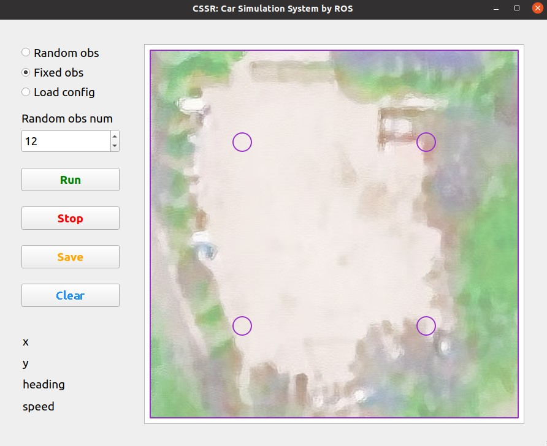
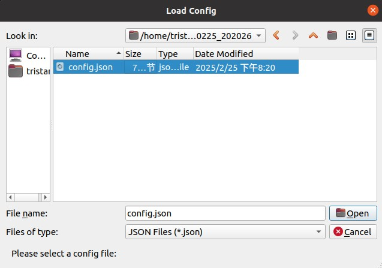
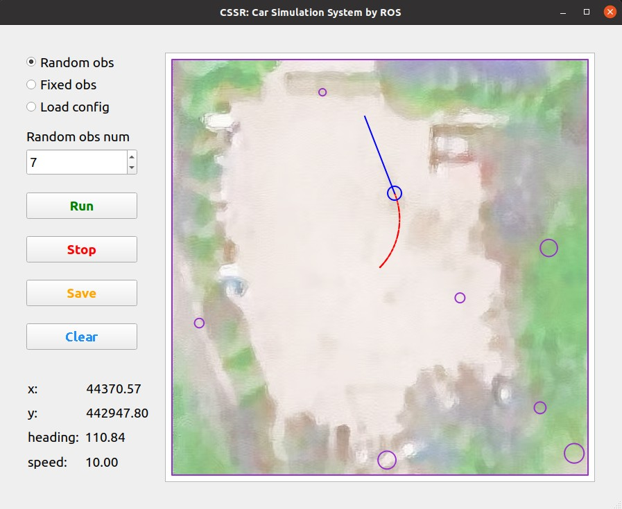

# CSSR: Car Simulation Software by ROS
**March 4, 2025 (Version 1.2.2)**
## Introduction
CSSR provides a simulation platform for testing the decision-making and planning system of autonomous vehicles.

## Software Architecture
The code is organized as follows:
- `src/CSSR` is the package used to run the simulation.
- `src/CSSR/scripts/main.pyc` is used to receive and send ROS messages.
- `src/CSSR/scripts/GUI.pyc` is used to run the interface and show the simulation figure.
- `src/CSSR/scripts/test.pyc` is used to run the test program to provide control messages to CSSR.
- `src/CSSR/launch/cssr.launch` is used to launch CSSR.
- `src/CSSR/launch/config.json` defines the initial vehicle state and obstacles.
- `src/cav_msgs` is the package that contains the messages used in the simulation.
- `src/cav_msgs/msg/Control.msg` defines the control message used in ROS communication.
- `src/cav_msgs/msg/Obstacle.msg` defines one obstacle in the field.
- `src/cav_msgs/msg/ObstacleVec.msg` defines the obstacle vector that combines all obstacle information in the field.
- `src/cav_msgs/msg/VehicleState.msg` defines the vehicle state used in ROS communication.

## Software Interfaces
The ROS message **subscribed** by CSSR is listed below:
- `/Control` is a `Control` message. CSSR uses this message to control the vehicle state in the simulation.  

The ROS messages **published** by CSSR are listed below:
- `/Obstacle` is an `ObstacleVec` message and combines all obstacle information in the field.
- `/VehicleState` is a `VehicleState` message and contains the state of the vehicle in the simulation.

The detailed definitions of the messages above can be found in the `src/cav_msgs/msg` folder.

**Therefore, the user needs to develop a program that can subscribe to the `/Obstacle` and `/VehicleState` messages published by CSSR, and publish `/Control` messages to control the car in the simulation.**

## Environment Setup
You can unzip the provided `CSSR.zip`, or download the code from the GitHub link below: 
<br>[https://github.com/myTristan/CSSR.git](https://github.com/myTristan/CSSR.git)<br>
Then you can install **python 3.8** and create a virtual python environment, and substitute `env` with your preferred environment name if you like.
```
cd CSSR
python -m venv env
source env/bin/activate
```
Then you can install CSSR dependencies:
```
pip install -r requirements.txt
```
 If you encounter issues downloading PyQt5, you can run the following command:
```
pip install PyQt5 -i https://mirrors.aliyun.com/pypi/simple/   
```
Press `Ctrl + Alt + T` to open a new command window, and build the ROS workspace:
```
cd CSSR
catkin_make
```

## Run CSSR
Open a new command window in the `CSSR/src/CSSR/scripts` folder, and run the code below:
```
chmod +x *.pyc
``` 
The step above is only required **the first time** you run CSSR.  
Open another new command window in the `CSSR` folder, and run the code below:
```
source env/bin/activate
source devel/setup.bash
roslaunch cssr cssr.launch
```
Then you can run CSSR successfully.

## Use CSSR
### Software Interface
The CSSR interface is divided into three sections. The button section includes buttons for setting simulation parameters and running the simulation. The data section displays the current data of the `/VehicleState` topic. The graph section shows the real-time simulation state.


### Set Parameters (Optional)
`src/CSSR/launch/config.json` defines the initial vehicle state and obstacles. `x` and `y` are the initial UTM coordinates, `speed_x` and `speed_y` are the initial speed, `heading` is the initial heading of the car, and `Obstacles` is the initial obstacles in the figure.
```json
{
    "Init_pos": 
    {   
        "x": 443703.533426, 
        "y": 4429467.347665, 
        "speed_x": 0, 
        "speed_y": 5, 
        "heading": 0.78
    },
    "Obstacles": []
}
``` 
If you want to change the initial vehicle state and obstacles, you can change the value above.

### Generate Obstacles
If you want to generate fixed obstacles, you can click the `Fixed obs` option in the radio button. Then the obstacles will be displayed in the figure.

If you want to generate random obstacles, you can click the `Random obs` option in the radio button, and change the number of obstacles in the spin box. Then the obstacles will be displayed in the figure. If you are not satisfied with the random obstacles, you can click the spin box and press `Enter` to change the random obstacles.

If you want to load previous simulation parameters and obstacles, you can click the `Load config` option in the radio button, and select the appropriate simulation config file (`config.json`). If the `config.json` is broken or the obstacles in it are invalid, an error message will be displayed in the software, and you will need to reload the config file.


### Run Simulation
Click the `Run` button to run the simulation. Click the `Stop` button to stop the simulation. 

Click the `Clear` button to clear the obstacles and trajectories in the figure.


### View Rostopic
Open a new command window in the `CSSR` folder, and run the code below:
```
source env/bin/activate
source devel/setup.bash
rostopic list
```
Then you can see the `/Control`, `/Obstacle`, and `/VehicleState` topics. If you want to view the details of the `/Control` topic, you can run the code below:
```
rostopic echo /Control
```

### Save Results
Click the `Save` button to save the config file and the figure in the `src/CSSR/logs` folder. The save path will be displayed in the data section.

The saved figure is shown below:


### Exit
To exit the program, please click the `×` in the top right corner of the window.

## History Versions
- Version 1.0 (January 31, 2025)
  - The initial design objectives have been achieved.
- Version 1.1 (February 7, 2025)
  - The software interface was redesigned to improve user-friendliness.
  - Added the functionality to monitor the `/VehicleState` topic from the software.
  - Added RTK position and UTM position to the `/VehicleState` topic.
  - Adjusted the update rate to 25 Hz.
  - Enhanced the resolution of the graph and the saved figure.
  - Fixed the definition of obstacles in the `/Obstacle` topic.
  - Increased the variety of test trajectories in `simtest.py`.
- Version 1.1.2 (February 10, 2025) by lsy
  - Changed the location of the background from workspace to `src/CSSR/resources`
  - Added log, when save button pressed, current obstacle configs and initial pos setup will be written to a json in `logs/MMDD_HHMMSS`, where the fig will also be saved
- Version 1.1.3 (February 15, 2025)
  - Added the functionality to load data from previous simulations.
  - Added the functionality to display the save path in the interface when saving results.
  - Improved the control logic of the car.
  - Replaced relative coordinates with UTM coordinates.
  - Used `roslaunch` to run the code.
- Version 1.2.0 (February 22, 2025)
  - Refactored `simmain.py` into `main.py` and `gui.py` to better align with the software design.
  - Added validation checks when loading obstacles.
  - Fixed the error caused by loading the wrong config file.
  - Fixed the error where saving would fail when there were no obstacles.
  - Fixed the error that occurred when switching obstacles during runtime.
- Version 1.2.1 (February 26, 2025) assisted by lsy
  - Optimized the code structure.
  - Optimized the shape and size of the obstacles.
  - Optimized the display frequency of simulation data in the terminal.
- Version 1.2.2 (March 4, 2025)
  - Fixed the error where obstacle messages were incorrect after clicking `Clear`.
  - Fixed the error where the obstacle radius scale was incorrect.

## Acknowledgments
I am grateful to Professor Xu and my senior colleagues for their meticulous guidance and assistance throughout the  development process.

## Contact
Developer
<br>[Zhmy](https://myTristan.github.io/)<br>
If you find any issues in CSSR, please feel free to contact me. I welcome your corrections.