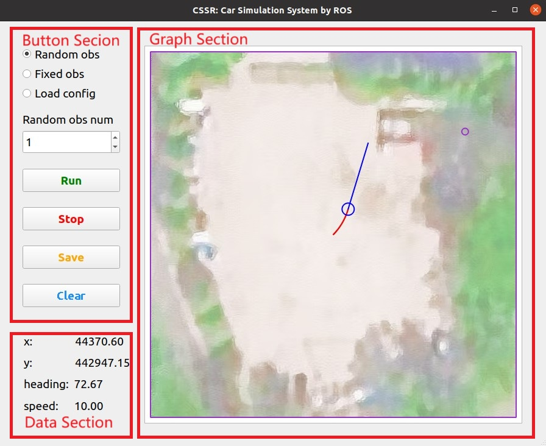
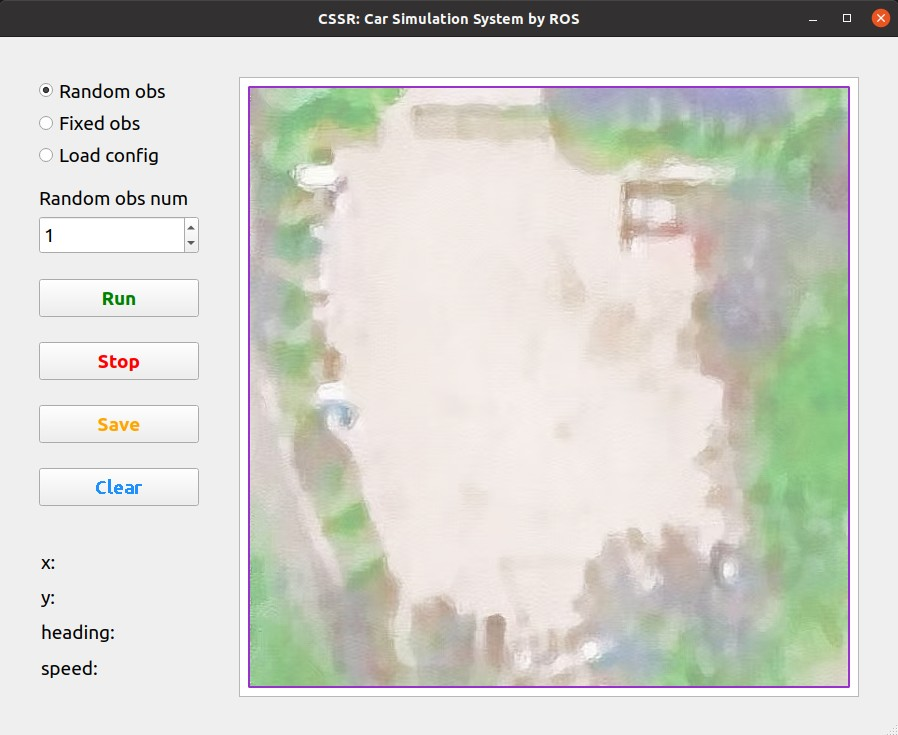

# CSSR: Car Simulation System by ROS
**February 7, 2025 (Version 1.1)**
## Introduction
CSSR provides a simulation platform for testing the decision-making and planning system of autonomous vehicles.

## Software Architecture
The code is organized as follows:
- `src/CSSR/scripts/simmain.py` is used to run CSSR.
- `src/CSSR/scripts/simtest.py` is used to run the test program to provide control messages to CSSR.
- `src/CSSR/msg/Control.msg` defines the control message used in ROS communication.
- `src/CSSR/msg/Obstacle.msg` defines one obstacle in the field.
- `src/CSSR/msg/ObstacleVec.msg` defines the obstacle vector that combines all obstacle information in the field.
- `src/CSSR/msg/VehicleState.msg` defines the vehicle state used in ROS communication.

## Software Interfaces
The ROS message subscribed by CSSR is listed below:
- `/Control` is a `Control` message. CSSR uses this message to control the vehicle state in the simulation.  

The ROS messages published by CSSR are listed below:
- `/Obstacle` is an `ObstacleVec` message and combines all obstacle information in the field.
- `/VehicleState` is a `VehicleState` message and contains the state of the vehicle in the simulation.

The detailed definitions of the messages above can be found in the `src/CSSR/msg` folder.

**Therefore, the user needs to develop a program that can subscribe to the `/Obstacle` and `/VehicleState` messages published by CSSR, and publish `/Control` messages to control the car in the simulation.**

`src/CSSR/scripts/simtest.py` can publish `/Control` messages to test the efficiency of CSSR, but cannot receive the messages published by CSSR.

## Environment Setup
You can unzip the provided `CSSR.zip`, or download the code from the GitHub link below: 
<br>
[https://github.com/myTristan/CSSR.git](https://github.com/myTristan/CSSR.git)
<br>
Then you can install python 3.8 and create a virtual python environment, and substitute `env` with your preferred environment name if you like.
```
cd CSSR
python -m venv env
source env/bin/activate
```
Then you can install CSSR dependencies:
```
pip install -r requirements.txt
```
If there is trouble in downloading PyQt5, you can run the code below:
```
pip install PyQt5* -i http:://mirrors.aliyun.com/pypi/simple
```
Press `Ctrl + Alt + T` to open a new command window, and compile the program:
```
cd CSSR
catkin_make
```

## Run CSSR
Open a new command window in the `CSSR` folder, and run the roscore:
```
roscore
```
Open another command window in the `CSSR` folder and run the test program to provide control messages to CSSR:
```
source env/bin/activate
source devel/setup.bash
rosrun cssr simtest.py
```
When your own decision-making and planning system is finished, you no longer need to run the code above.  
Open another command window in the `CSSR` folder and run the software:
```
source env/bin/activate
source devel/setup.bash
rosrun cssr simmain.py
```
Then you can see the software interface of CSSR.

## Use CSSR
### Software Interface
The interface of CSSR is divided into three sections. The button section contains buttons to set the simulation parameters and run the simulation. The data section displays the current data of the `/VehicleState` topic. The graph section shows the real-time simulation state.


### Set Parameters (Optional)
`simmain.py` defines some simulation parameters.
``` python
# Parameters
# Square boundary (1 corresponds to 0.1 m)
boundary = 600
# Time interval
T = 40 # 40 ms 25 Hz
```
If you want to change the boundary of the figure, you can change the value of `boundary`. If you want to change the time interval between each simulation step, you can change the value of `T`.

### Generate Obstacles
If you want to generate fixed obstacles, you can click the `Fixed obs` option in the radio button. Then the obstacles will be displayed in the figure.

If you want to generate random obstacles, you can click the `Random obs` option in the radio button, and change the number of obstacles in the spin box. Then the obstacles will be displayed in the figure. If you are not satisfied with the random obstacles, you can click the spin box and press `Enter` to change the random obstacles.


### Run Simulation
Click the `Run` button to run the simulation. Click the `Stop` button to stop the simulation. 

Click the `Clear` button to clear the obstacles and trajectories in the figure.


### View Rostopic
Open a new command window in the `CSSR` folder, and run the code below:
```
source env/bin/activate
source devel/setup.bash
rostopic list
```
Then you can see the `/Control`, `/Obstacle`, and `/VehicleState` topics. If you want to view the details of the `/Control` topic, you can run the code below:
```
rostopic echo /Control
```

### Save Figure
Click the `Save` button to save the figure. Then you can choose the filename and the path to save the figure in the pop-up window.

The saved figure is shown below:


### Exit
To exit the program, please click the `×` in the top right corner of the window.

## History Versions
- Version 1.0 (January 31, 2025)
  - The design objectives have been initially achieved.
- Version 1.1 (February 7, 2025)
  - Redesigned the software interface to make it more user-friendly.
  - Added the functionality to monitor the `/VehicleState` topic from the software.
  - Added RTK position and UTM position to the `/VehicleState` topic.
  - Adjusted the update rate to 25 Hz.
  - Enhanced the resolution of the graph and the saved figure.
  - Fixed the definition of obstacles in the `/Obstacle` topic.
  - Increased the variety of test trajectories in `simtest.py`.

## Future Developments
Although the design objectives have been initially achieved, there may still be some aspects to improve depending on the requirements.
- Make the software interface more suitable, elegant, and user-friendly.
- Complete the assignment of messages.
- Generate more diverse obstacles.
- Change the car model from dot to rectangle.
- Improve the control logic of the car.
- Add the function of detecting collisions between the car and the obstacles.
- Solve the potential bugs in the software.

## Acknowledgments
I am grateful to Professor Xu and my senior colleagues for their meticulous guidance and assistance throughout the  development process.

## Contact
Developer<br>
[Zhmy](https://myTristan.github.io/)
<br>
If there are any shortcomings in CSSR, please feel free to email me. I welcome your corrections.
<!-- If there are any shortcomings in my answers, please feel free to email me (zhmy22@mails.tsinghua.edu.cn). I welcome your corrections. -->
